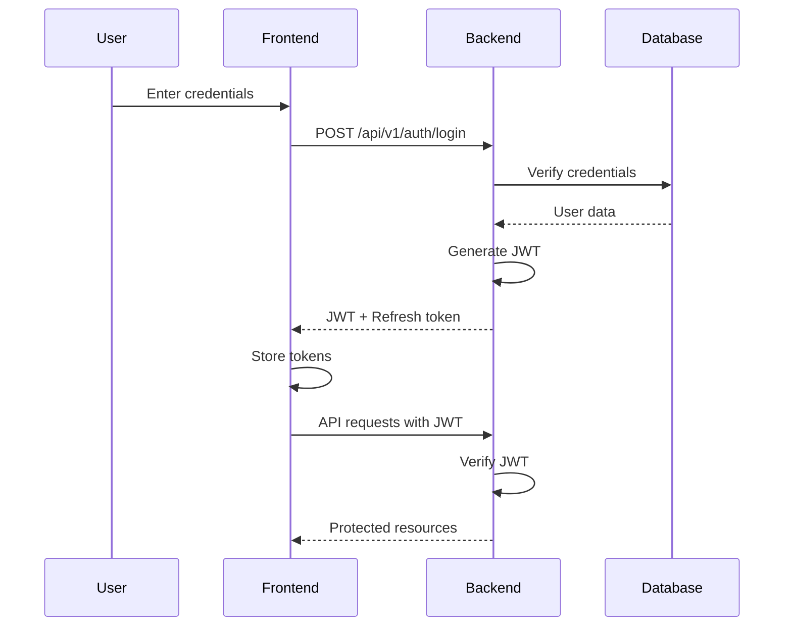

# Security Architecture

## Overview

The Building Asset Management Platform implements a comprehensive security architecture based on industry best practices. This document outlines the security measures, authentication mechanisms, and authorization strategies used throughout the system.

## Authentication

### JWT (JSON Web Tokens)

The platform uses JWT for stateless authentication:

- **Token Structure**: Header.Payload.Signature
- **Algorithm**: HS256 (HMAC with SHA-256)
- **Token Lifetime**: 24 hours (configurable)
- **Refresh Token**: 7 days (configurable)

### Authentication Flow



### Password Security

- **Hashing**: bcrypt with cost factor 10
- **Minimum Requirements**: 6 characters (configurable)
- **Storage**: Only hashed passwords stored in database

## Authorization

### RBAC (Role-Based Access Control)

The platform implements a flexible RBAC system:

#### Role Hierarchy
1. **Super Admin**: Full system access
2. **Admin**: Organization-level administration
3. **Manager**: Asset management capabilities
4. **User**: Basic viewing permissions

#### Permission Model

```go
type Permission struct {
    Resource string // e.g., "asset", "user", "report"
    Action   string // e.g., "create", "read", "update", "delete"
}
```

### API Security

#### Request Authentication
All API requests (except public endpoints) require:
```http
Authorization: Bearer <JWT_TOKEN>
```

#### CORS Configuration
```go
cors.Config{
    AllowOrigins:     []string{"http://localhost:3000"},
    AllowMethods:     []string{"GET", "POST", "PUT", "DELETE", "OPTIONS"},
    AllowHeaders:     []string{"Origin", "Content-Type", "Authorization"},
    ExposeHeaders:    []string{"Content-Length"},
    AllowCredentials: true,
    MaxAge:          12 * time.Hour,
}
```

## Data Protection

### Database Security

1. **Connection Encryption**: TLS/SSL for database connections
2. **Query Protection**: Parameterized queries to prevent SQL injection
3. **Access Control**: Principle of least privilege for database users

### API Security Headers

```go
// Security headers middleware
func SecurityHeaders() gin.HandlerFunc {
    return func(c *gin.Context) {
        c.Header("X-Content-Type-Options", "nosniff")
        c.Header("X-Frame-Options", "DENY")
        c.Header("X-XSS-Protection", "1; mode=block")
        c.Header("Strict-Transport-Security", "max-age=31536000")
        c.Next()
    }
}
```

## Audit and Logging

### Audit Trail

All sensitive operations are logged:
- User authentication attempts
- Permission changes
- Data modifications
- System configuration changes

### Log Structure

```json
{
    "timestamp": "2024-01-01T12:00:00Z",
    "user_id": "123",
    "action": "UPDATE_ASSET",
    "resource": "asset:456",
    "ip_address": "192.168.1.1",
    "user_agent": "Mozilla/5.0...",
    "result": "success"
}
```

## Session Management

### Token Lifecycle

1. **Login**: Generate access and refresh tokens
2. **API Calls**: Validate access token on each request
3. **Token Refresh**: Use refresh token to get new access token
4. **Logout**: Invalidate tokens (optional blacklist)

### Security Considerations

- Tokens stored in httpOnly cookies (production)
- Secure flag enabled for HTTPS
- SameSite attribute to prevent CSRF
- Token rotation on refresh

## Best Practices Implementation

### Input Validation

- All inputs validated at API layer
- Type checking and sanitization
- Length limits enforced
- Special character handling

### Error Handling

- Generic error messages to prevent information leakage
- Detailed errors logged internally only
- Rate limiting on authentication endpoints

### Security Updates

- Regular dependency updates
- Security patch monitoring
- Vulnerability scanning in CI/CD pipeline

## Compliance Considerations

### Data Privacy

- Personal data encryption at rest
- Right to erasure (GDPR compliance ready)
- Data minimization principles
- Access logs for audit trails

### Security Standards

The platform is designed to align with:
- OWASP Top 10 security risks
- ISO 27001 principles
- SOC 2 requirements (where applicable)

## Incident Response

### Security Monitoring

- Failed login attempt tracking
- Unusual access pattern detection
- API rate limiting and throttling
- Security event logging

### Response Procedures

1. **Detection**: Automated alerts for security events
2. **Analysis**: Log review and impact assessment
3. **Containment**: Account lockout, token revocation
4. **Recovery**: System restoration procedures
5. **Documentation**: Incident report generation

## Future Enhancements

- Multi-factor authentication (MFA)
- OAuth2/SAML integration
- IP whitelisting
- Advanced threat detection
- Encryption key rotation