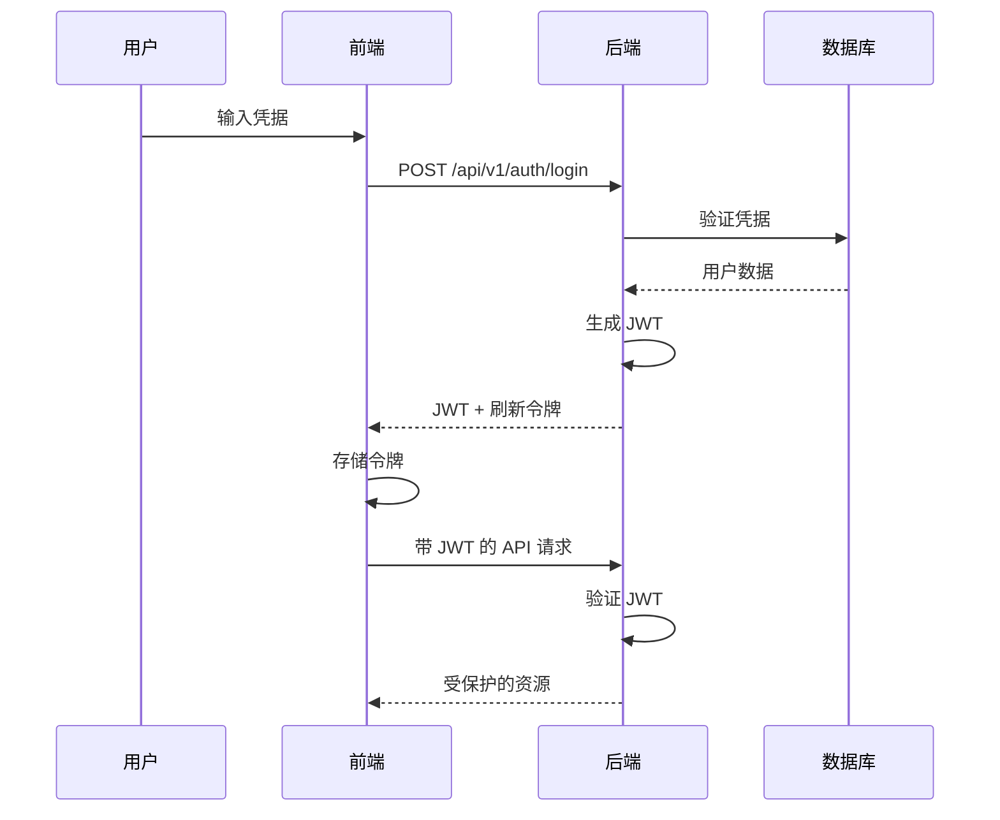

# 安全架构

## 概述

楼宇资产管理平台基于业界最佳实践实现了全面的安全架构。本文档概述了整个系统中使用的安全措施、认证机制和授权策略。

## 认证

### JWT（JSON Web Tokens）

平台使用 JWT 进行无状态认证：

- **令牌结构**：Header.Payload.Signature
- **算法**：HS256（使用 SHA-256 的 HMAC）
- **令牌有效期**：24 小时（可配置）
- **刷新令牌**：7 天（可配置）

### 认证流程



### 密码安全

- **哈希算法**：使用成本因子 10 的 bcrypt
- **最低要求**：6 个字符（可配置）
- **存储方式**：数据库仅存储哈希后的密码

## 授权

### RBAC（基于角色的访问控制）

平台实现了灵活的 RBAC 系统：

#### 角色层次
1. **超级管理员**：完全系统访问权限
2. **管理员**：组织级别管理权限
3. **经理**：资产管理能力
4. **用户**：基本查看权限

#### 权限模型

```go
type Permission struct {
    Resource string // 例如："asset"、"user"、"report"
    Action   string // 例如："create"、"read"、"update"、"delete"
}
```

### API 安全

#### 请求认证
所有 API 请求（公开端点除外）都需要：
```http
Authorization: Bearer <JWT_TOKEN>
```

#### CORS 配置
```go
cors.Config{
    AllowOrigins:     []string{"http://localhost:3000"},
    AllowMethods:     []string{"GET", "POST", "PUT", "DELETE", "OPTIONS"},
    AllowHeaders:     []string{"Origin", "Content-Type", "Authorization"},
    ExposeHeaders:    []string{"Content-Length"},
    AllowCredentials: true,
    MaxAge:          12 * time.Hour,
}
```

## 数据保护

### 数据库安全

1. **连接加密**：数据库连接使用 TLS/SSL
2. **查询保护**：使用参数化查询防止 SQL 注入
3. **访问控制**：数据库用户遵循最小权限原则

### API 安全头

```go
// 安全头中间件
func SecurityHeaders() gin.HandlerFunc {
    return func(c *gin.Context) {
        c.Header("X-Content-Type-Options", "nosniff")
        c.Header("X-Frame-Options", "DENY")
        c.Header("X-XSS-Protection", "1; mode=block")
        c.Header("Strict-Transport-Security", "max-age=31536000")
        c.Next()
    }
}
```

## 审计和日志

### 审计跟踪

记录所有敏感操作：
- 用户认证尝试
- 权限变更
- 数据修改
- 系统配置变更

### 日志结构

```json
{
    "timestamp": "2024-01-01T12:00:00Z",
    "user_id": "123",
    "action": "UPDATE_ASSET",
    "resource": "asset:456",
    "ip_address": "192.168.1.1",
    "user_agent": "Mozilla/5.0...",
    "result": "success"
}
```

## 会话管理

### 令牌生命周期

1. **登录**：生成访问令牌和刷新令牌
2. **API 调用**：每个请求验证访问令牌
3. **令牌刷新**：使用刷新令牌获取新的访问令牌
4. **登出**：使令牌失效（可选黑名单）

### 安全考虑

- 令牌存储在 httpOnly cookies 中（生产环境）
- 为 HTTPS 启用 Secure 标志
- SameSite 属性防止 CSRF
- 刷新时进行令牌轮换

## 最佳实践实施

### 输入验证

- 在 API 层验证所有输入
- 类型检查和清理
- 强制执行长度限制
- 特殊字符处理

### 错误处理

- 通用错误消息防止信息泄露
- 仅在内部记录详细错误
- 认证端点的速率限制

### 安全更新

- 定期依赖更新
- 安全补丁监控
- CI/CD 管道中的漏洞扫描

## 合规性考虑

### 数据隐私

- 静态数据加密
- 删除权（GDPR 合规就绪）
- 数据最小化原则
- 审计跟踪的访问日志

### 安全标准

平台设计符合：
- OWASP Top 10 安全风险
- ISO 27001 原则
- SOC 2 要求（适用情况下）

## 事件响应

### 安全监控

- 失败登录尝试跟踪
- 异常访问模式检测
- API 速率限制和节流
- 安全事件日志记录

### 响应程序

1. **检测**：安全事件的自动警报
2. **分析**：日志审查和影响评估
3. **遏制**：账户锁定、令牌撤销
4. **恢复**：系统恢复程序
5. **文档**：事件报告生成

## 未来增强

- 多因素认证（MFA）
- OAuth2/SAML 集成
- IP 白名单
- 高级威胁检测
- 加密密钥轮换