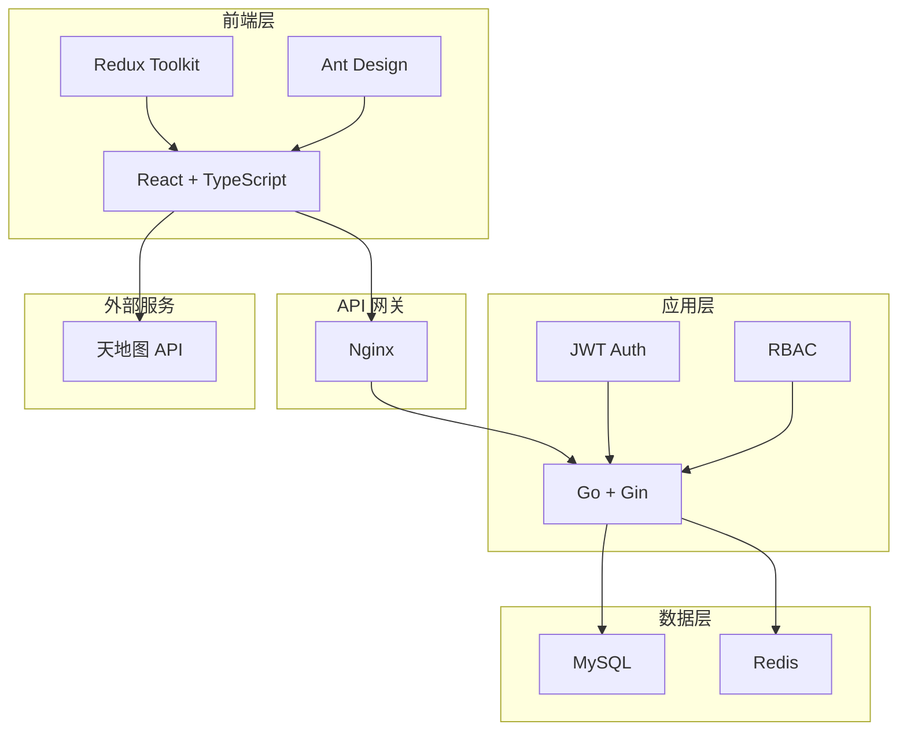

# 技术栈

## 概述

本文档详细介绍了楼宇资产管理平台所使用的技术栈，包括选择这些技术的理由和它们如何协同工作。

## 后端技术栈

### 核心技术

#### Go (Golang) 1.18+
- **选择理由**：
  - 高性能和并发处理能力
  - 编译型语言，部署简单
  - 强大的标准库
  - 优秀的内存管理
  - 适合构建微服务

#### Gin Web 框架
- **版本**：v1.9.1
- **选择理由**：
  - 轻量级高性能
  - 中间件支持
  - RESTful API 友好
  - 活跃的社区支持
  - 优秀的路由性能

#### GORM
- **版本**：v1.25.5
- **选择理由**：
  - 功能完善的 ORM
  - 支持多种数据库
  - 自动迁移
  - 关联预加载
  - 钩子函数支持

### 数据存储

#### MySQL 5.7+
- **主数据库**
- **选择理由**：
  - 成熟稳定
  - ACID 合规
  - 广泛的工具支持
  - 优秀的性能
  - 支持复杂查询

#### Redis
- **缓存和会话存储**
- **选择理由**：
  - 高性能键值存储
  - 支持多种数据结构
  - 发布/订阅功能
  - 持久化选项
  - 集群支持

#### SQLite（开发/演示）
- **轻量级替代方案**
- **选择理由**：
  - 零配置
  - 无需服务器
  - 适合开发和测试
  - 文件级数据库

### 安全和认证

#### JWT (JSON Web Tokens)
- **用于无状态认证**
- **实现库**：golang-jwt/jwt
- **特性**：
  - 无状态认证
  - 跨域支持
  - 可扩展的声明
  - 签名验证

#### Bcrypt
- **密码哈希**
- **成本因子**：10
- **特性**：
  - 加盐哈希
  - 防彩虹表攻击
  - 可调整的计算成本

### 工具库

#### Viper
- **配置管理**
- **支持格式**：YAML、JSON、TOML
- **特性**：
  - 环境变量支持
  - 热重载
  - 默认值设置

#### Zap
- **结构化日志**
- **特性**：
  - 高性能
  - 结构化输出
  - 日志级别控制
  - 自定义编码器

## 前端技术栈

### 核心框架

#### React 18
- **选择理由**：
  - 组件化开发
  - 虚拟 DOM 高效更新
  - 庞大的生态系统
  - 并发特性
  - Hooks API

#### TypeScript
- **版本**：4.9+
- **选择理由**：
  - 类型安全
  - 更好的 IDE 支持
  - 提前发现错误
  - 自文档化代码
  - 重构更安全

### UI 框架

#### Ant Design 5
- **选择理由**：
  - 企业级设计语言
  - 丰富的组件库
  - 中文友好
  - 主题定制
  - TypeScript 支持

#### Ant Design Charts
- **数据可视化**
- **基于 G2Plot**
- **特性**：
  - 声明式 API
  - 响应式设计
  - 丰富的图表类型

### 状态管理

#### Redux Toolkit
- **选择理由**：
  - 官方推荐方案
  - 简化的 Redux 使用
  - 内置 Immer
  - RTK Query 集成
  - DevTools 支持

### 开发工具

#### Create React App
- **脚手架工具**
- **特性**：
  - 零配置启动
  - 热模块替换
  - 生产优化
  - 测试集成

#### ESLint + Prettier
- **代码质量保证**
- **特性**：
  - 代码规范检查
  - 自动格式化
  - Git hooks 集成

### HTTP 客户端

#### Axios
- **选择理由**：
  - Promise 基础
  - 请求/响应拦截器
  - 自动 JSON 转换
  - 错误处理
  - 取消请求支持

## 地图服务

### 天地图 API
- **选择理由**：
  - 国产地图服务
  - 数据准确性高
  - 政府背景
  - 免费配额充足
  - 支持多种地图类型

## 开发和部署

### 容器化

#### Docker
- **版本**：20.10+
- **用途**：
  - 统一开发环境
  - 简化部署
  - 服务隔离
  - 版本控制

#### Docker Compose
- **版本**：2.x
- **用途**：
  - 多容器编排
  - 开发环境搭建
  - 服务依赖管理

### 构建工具

#### Make
- **用途**：
  - 任务自动化
  - 构建流程标准化
  - 跨平台支持

### 版本控制

#### Git
- **工作流**：Git Flow
- **分支策略**：
  - main：生产分支
  - develop：开发分支
  - feature/*：功能分支
  - hotfix/*：紧急修复

## 技术架构图

## 技术选型原则

1. **成熟稳定**：选择经过生产验证的技术
2. **社区活跃**：确保长期支持和问题解决
3. **性能优先**：满足高并发和大数据量需求
4. **开发效率**：提供良好的开发体验
5. **可维护性**：代码清晰，文档完善
6. **安全性**：内置安全最佳实践

## 未来技术规划

### 短期目标
- GraphQL API 支持
- WebSocket 实时通信
- 单元测试覆盖率提升
- CI/CD 流程优化

### 长期目标
- 微服务架构迁移
- Kubernetes 部署
- 服务网格（Istio）
- 分布式追踪（Jaeger）
- 消息队列（RabbitMQ/Kafka）